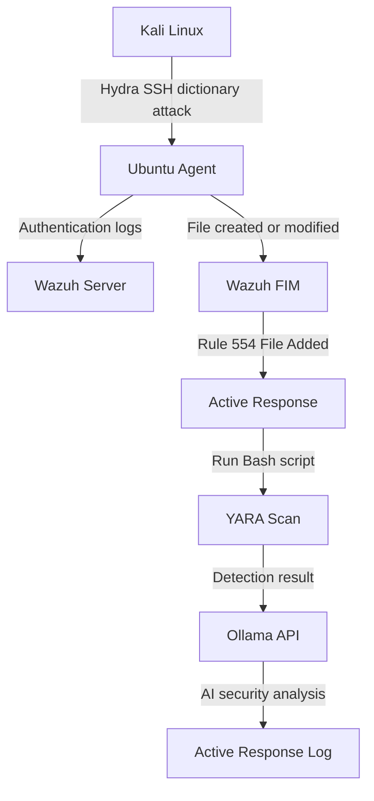

# Architecture

This lab consists of three virtual machines connected in an isolated network.

## Components

- Kali Linux – attack machine
- Ubuntu Agent – monitored endpoint with Wazuh Agent
- Wazuh Server – SIEM, manager, dashboard and Ollama host

---

## High-level Flow

---

## Scenario 1

Kali Linux uses Hydra to perform an SSH dictionary attack against the Ubuntu Agent.  
Authentication events are logged on the endpoint and collected by Wazuh.

---

## Scenario 2

Wazuh File Integrity Monitoring detects a new EICAR test file.  
Active Response launches a Bash script, scans the file with YARA and sends the result to Ollama for AI-assisted analysis.
